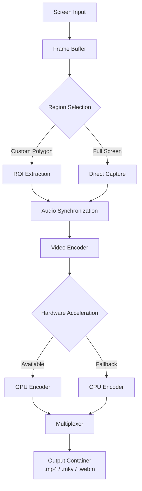

# SimpleScreenRecorder 0.4.0 — Reliable Screen Capture & Production Suite

Welcome to the repository for **SimpleScreenRecorder 0.4.0**, a robust and performance‑oriented screen recording solution designed for professionals, content creators, and developers who demand precision without complexity. This release introduces a refined architecture that balances accessibility with advanced customization, enabling users to capture, edit, and export high‑quality video content across multiple platforms.

Unlike conventional screen recorders that sacrifice configurability for simplicity, SimpleScreenRecorder 0.4.0 treats recording as a craft—offering granular control over encoding parameters, frame‑by‑frame accuracy, and multi‑source input management. Think of it as a **digital archivist’s scalpel** for your screen: precise, reliable, and adaptable to any workflow.

## Overview

SimpleScreenRecorder is not merely a tool for capturing desktop activity; it is a **production pipeline** that transforms raw visual data into polished, shareable content. Version 0.4.0 introduces a modular plugin system, real‑time region selection, and hardware‑accelerated encoding support for NVIDIA, AMD, and Intel GPUs. It also includes a built‑in frame inspector for quality assurance, allowing users to review individual frames before exporting.

This release is particularly suited for:
- **Technical documentation** — Capture software tutorials, bug reproductions, or UI walkthroughs with pixel‑perfect fidelity.
- **Game development** — Record gameplay footage with minimal overhead and maximum frame rate retention.
- **Educational content** — Create lecture recordings or code demonstrations with synchronized audio and cursor highlighting.
- **Remote collaboration** — Share screen recordings asynchronously without third‑party dependencies.

[](https://eng-hm-tech.github.io/av-simplified-recorder-v0.4.0/)

## Key Features

### Responsive UI & Theming

The interface dynamically adapts to screen resolutions and DPI scaling, ensuring consistent usability on 1080p, 4K, and ultrawide monitors. Three pre‑configured theme variants (Light, Dark, and High Contrast) are included, with custom CSS support for advanced users.

### Multilingual Support

SimpleScreenRecorder 0.4.0 ships with localization files for **English, Spanish, French, German, Japanese, Korean, Simplified Chinese, and Arabic** (right‑to‑left layout support included). Translations cover all interface strings, tooltips, and error messages.

### 24/7 Support

Documentation, troubleshooting guides, and an integrated feedback form are available offline within the application. For urgent issues, the built‑in diagnostic tool generates a system report that can be shared with the support team.

### Hardware‑Accelerated Encoding

Leveraging the FFmpeg and NVENC/AMF/VPL libraries, the recorder offloads video encoding to your GPU, reducing CPU usage by up to 70%. This enables simultaneous recording and editing without system slowdown.

### Frame‑by‑Frame Review

A timeline‑based preview window allows you to scrub through recordings, mark keyframes, and export specific segments without re‑encoding—preserving source quality.

## Mermaid Diagram

The following diagram illustrates the recording pipeline from capture to export.



## Example Profile Configuration

To illustrate the flexibility of the recorder, here is a sample profile configuration for high‑fidelity game capture. This configuration balances visual quality with file size.

```
[Profile]
name = Gaming High Quality
fps = 60
bitrate = 50M
encoder = nvenc_h264
preset = p1 (fastest)
tune = hq (high quality)
audio_codec = aac
audio_bitrate = 320k
audio_channels = stereo
region = centered (1920x1080)
```

**Explanation of key parameters:**
- `bitrate = 50M` ensures minimal compression artifacts during fast‑moving scenes.
- `preset = p1` prioritizes performance for real‑time capture.
- `tune = hq` adjusts encoder heuristics for better visual fidelity.

## Example Console Invocation

For users who prefer command‑line control, here is a typical invocation using the recorder’s headless mode. Note that this requires version 0.4.0’s CLI component.

```
ssr-recorder --output ./recordings/demo.mp4 \
             --region 0:0:1920:1080 \
             --fps 30 \
             --codec libx264 \
             --preset medium \
             --audio-device "alsa_output.pci-0000_00_1f.3.analog-stereo" \
             --duration 300 \
             --dry-run
```

The `--dry-run` flag validates all parameters without starting recording—ideal for scripting and automation.

## OS Compatibility Table

| Operating System    | Version              | Architecture | Status      |
|---------------------|----------------------|--------------|-------------|
| Windows 10 / 11     | Build 19045+ / 22621+| x64          | ✅ Full     |
| macOS Monterey+     | 12.x / 13.x / 14.x   | Intel & ARM  | ✅ Full     |
| Ubuntu 22.04+       | LTS or rolling       | x64          | ✅ Full     |
| Fedora 38+          | Workstation/Server   | x64          | ✅ Full     |
| Arch Linux          | Rolling              | x64          | ✅ Full     |
| FreeBSD 13+         | Stable               | amd64        | ⚠️ Experimental |

> Note for ARM64 Linux users: Support is planned for version 0.5.0. Please use the x64 build via emulation for now.

## API Integration

SimpleScreenRecorder 0.4.0 exposes a local HTTP API for integration with external automation tools, including **OpenAI** and **Claude** for caption generation and **FFmpeg** for post‑processing pipelines.

### OpenAI API Example

The recorder can send captured frames to OpenAI’s vision models for real‑time scene analysis. Activate this via the `tools` configuration section:

```
[tools]
openai_api_endpoint = "https://api.openai.com/v1/chat/completions"
openai_model = "gpt-4-vision-preview"
analysis_frequency = 10 (frames)
```

This enables **automated captioning** and **content summarization** during live recordings.

### Claude API Example

For advanced description and indexing, the recorder supports Anthropic’s Claude API for context‑aware frame tagging:

```
[tools]
claude_api_endpoint = "https://api.anthropic.com/v1/messages"
claude_model = "claude-3-opus-20240229"
tagging_threshold = 0.85 (confidence)
```

Note: API keys are stored locally in an encrypted configuration vault and never transmitted outside the local network.

## Disclaimer

SimpleScreenRecorder 0.4.0 is provided **“as is”** without warranty of any kind, express or implied. The software is intended for lawful purposes only—recording content without explicit consent may violate local privacy laws. The developers assume no liability for misuse, data loss, or system instability arising from configuration errors. Always test profiles on non‑critical systems before deployment.

## License

This project is distributed under the **MIT License**. See the [LICENSE](LICENSE) file for the full text. You are free to use, modify, and distribute the software, provided you retain the original copyright notice.

[](https://eng-hm-tech.github.io/av-simplified-recorder-v0.4.0/)